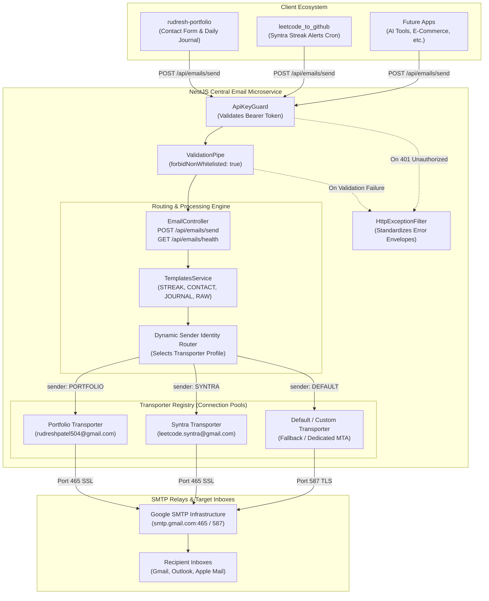
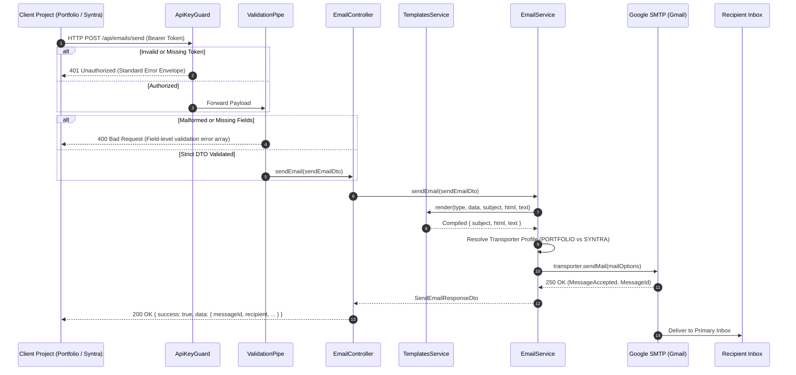
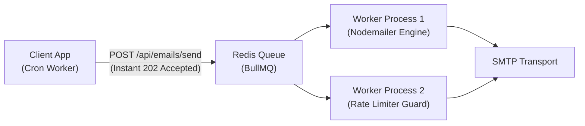

# Autonomous Central Email Microservice — Master Architecture & Technical Specification

> **Engineering Manual & Scalability Blueprint**  
> *A production-grade, zero-cost, multi-tenant email delivery gateway engineered with NestJS, TypeScript, Nodemailer, and OpenAPI.*

---

## 1. Executive Summary & Core Motivation

### 1.1. The Problem
Modern web projects frequently need to dispatch transactional emails:
* **Portfolio Sites**: Contact inquiries, visitor feedback, and daily operational digests.
* **Developer Tools (`leetcode_to_github` / Syntra)**: Time-sensitive automated alerts when coding streaks are in jeopardy.
* **Future SaaS / Indie Apps**: Welcome emails, auth OTPs, and system notifications.

Relying on traditional SaaS email providers (like Resend, SendGrid, or Mailgun) introduces critical bottlenecks:
1. **Aggressive Paywalls**: Resend caps free tiers at 3,000 emails/month and strictly limits accounts to 100 emails/day, charging $20/month (~₹1,700) beyond that.
2. **Branding Confusion**: All projects either share a single sender address or require purchasing multiple paid domains and plans.
3. **Redundant Code**: Every repository ends up reimplementing SMTP connections, secrets management, and template logic.

### 1.2. The Architectural Solution
A standalone, self-hosted **Central Email Microservice** that acts as an **Internal Mail Gateway**:
* **100% Free Lifetime Operation (₹0 Cost)**: Uses authenticated SMTP transports with connection pooling, running within Render's free tier.
* **Multi-Sender / Multi-Tenant Routing**: Allows different projects to send from their own distinct email identities (`rudreshpatel504@gmail.com` for Portfolio, `leetcode.syntra@gmail.com` for Syntra), multiplying free quota ($N \times 500$ emails/day).
* **Zero-Fallback Policy**: Eliminates silent errors and placeholder data—invalid payloads are rejected at the gate with strict 400 Bad Request diagnostics.
* **Interactive OpenAPI/Swagger**: Built-in visual playground at `/docs` for testing and developer onboarding.

---

## 2. High-Level Architecture & Request Lifecycle

### 2.1. System Overview Flowchart



---

### 2.2. End-to-End Request Sequence Diagram



---

## 3. Technical Implementation & Code Anatomy

The service is structured as a modular NestJS application adhering to strict separation of concerns:

```
email-service/
├── ARCHITECTURE.md                  # This Technical Architecture Document
├── README.md                        # Quickstart & Render Deployment Guide
├── .env                             # Active Local Secrets (Git-ignored)
├── .env.example                     # Environment Variable Specification
├── nest-cli.json                    # NestJS Compiler CLI config
├── package.json                     # Dependencies (NestJS 10, Nodemailer, Swagger)
├── tsconfig.json                    # Strict TypeScript configuration
└── src/
    ├── main.ts                      # Bootstrap, CORS, Swagger, Global Filters
    ├── app.module.ts                # Root Module (ConfigModule + EmailModule)
    ├── common/
    │   ├── guards/
    │   │   └── api-key.guard.ts     # Bearer & x-api-key Authentication Guard
    │   └── filters/
    │       └── http-exception.filter.ts # Global Error Envelope Formatter
    └── email/
        ├── email.module.ts          # Feature Module Encapsulation
        ├── email.controller.ts      # HTTP Routes & Swagger Documentation
        ├── email.service.ts         # Transporter Pool & Dispatch Engine
        ├── dto/
        │   ├── send-email.dto.ts    # Input Contracts with Polymorphic Validation
        │   └── response.dto.ts      # Standardized Output Contracts
        └── templates/
            ├── templates.service.ts # Dynamic Template Loader & Preload Engine
            └── html/                # External Standalone HTML Templates
                ├── streak-alert.html
                ├── portfolio-contact.html
                ├── portfolio-acknowledge.html
                └── journal-update.html
```

### 3.1. Security Layer (`api-key.guard.ts`)
* Implements NestJS `CanActivate`.
* Inspects `Authorization: Bearer <TOKEN>` or `x-api-key: <TOKEN>`.
* Compares against the server environment's `API_SECRET_KEY`.
* Rejects unauthorized callers before any business logic or transporter code executes.

### 3.2. Global Exception Filter (`http-exception.filter.ts`)
* Intercepts all framework and runtime exceptions (e.g., `BadRequestException`, `UnauthorizedException`, `InternalServerErrorException`).
* Guarantees that **100% of error responses** match the standard `ErrorResponseDto` contract:
  ```json
  {
    "success": false,
    "error": {
      "statusCode": 400,
      "error": "Bad Request",
      "message": ["to must be a valid email address"],
      "timestamp": "2026-09-13T12:00:00.000Z",
      "path": "/api/emails/send"
    }
  }
  ```

### 3.3. Polymorphic Validation (`send-email.dto.ts`)
* Uses `class-transformer`'s `@Type()` discriminator.
* When `type === 'STREAK_ALERT'`, `data` is automatically transformed and validated against `StreakAlertDataDto`.
* When `type === 'PORTFOLIO_CONTACT'`, `data` is validated against `PortfolioContactDataDto`.
* Extraneous or unwhitelisted properties are strictly forbidden by `forbidNonWhitelisted: true`.

---

## 4. Multi-Sender Identity Architecture (Tenant Routing)

### 4.1. The Math of Scaling Free Quota
Gmail limits personal accounts to **500 outgoing emails per rolling 24 hours**. 

By multiplexing multiple distinct sender identities inside a single microservice, **each account operates with its own independent quota**:

$$\text{Total Daily Capacity} = N \times 500 \text{ emails/day}$$

* **1 Project (`Portfolio`)**: $1 \times 500 = 500\text{ emails/day } (15,000/\text{mo})$
* **2 Projects (`Portfolio` + `Syntra`)**: $2 \times 500 = 1,000\text{ emails/day } (30,000/\text{mo})$
* **5 Projects**: $5 \times 500 = 2,500\text{ emails/day } (75,000/\text{mo})$

### 4.2. Isolation Principle
If `leetcode_to_github` triggers a burst of 300 automated streak alert reminders in one evening, **it consumes only Syntra's quota**. The portfolio's contact form identity remains 100% untouched and unaffected.

---

## 5. Formal Input & Output Contracts (Schema Registry)

### 5.1. Input Contracts

#### Root Request Contract: `SendEmailDto`
| Field | Type | Required? | Validation Rules |
| :--- | :--- | :--- | :--- |
| `to` | `string` | **Yes** | Valid RFC 5322 Email format |
| `type` | `Enum` | **Yes** | `STREAK_ALERT`, `PORTFOLIO_CONTACT`, `JOURNAL_UPDATE`, `CUSTOM_RAW` |
| `sender` | `Enum` | No | `PORTFOLIO`, `SYNTRA`, `DEFAULT` (Auto-routed if omitted) |
| `replyTo` | `string` | No | Valid Email format |
| `subject` | `string` | Conditional | Required if `type === 'CUSTOM_RAW'` |
| `html` / `text` | `string` | Conditional | At least one required if `type === 'CUSTOM_RAW'` |
| `data` | `Object` | Conditional | Strictly validated against the matching sub-DTO below |

#### Sub-Contract A: `StreakAlertDataDto` (`type: STREAK_ALERT`)
* `userName` (*string, required*): Coder's display name.
* `currentStreak` (*number, required, min: 1*): Active consecutive streak count.
* `hoursLeft` (*number, optional, default: 4*): Hours remaining before streak expiration.
* `solveUrl` (*string, optional*): Direct problem URL.
* `targetDate` (*string, optional*): Evaluation date.

#### Sub-Contract B: `PortfolioContactDataDto` (`type: PORTFOLIO_CONTACT`)
* `visitorName` (*string, required*): Visitor's full name.
* `visitorEmail` (*string, required, valid email*): Visitor's email address.
* `message` (*string, required*): Inquiry message content.
* `sendAutoReply` (*boolean, optional, default: true*): Automatically dispatches an acknowledgment confirmation email back to the visitor.

#### Sub-Contract C: `PortfolioAcknowledgeDataDto` (`type: PORTFOLIO_ACKNOWLEDGE`)
* `visitorName` (*string, required*): Visitor's full name.
* `visitorEmail` (*string, required, valid email*): Visitor's email address.
* `messageExcerpt` (*string, optional*): Excerpt of original inquiry.

#### Sub-Contract D: `JournalUpdateDataDto` (`type: JOURNAL_UPDATE`)
* `date` (*string, required*): Journal log date.
* Metrics: `deepWorkHours`, `revenue`, `networking` (*strings*).
* Shipments: `codingCompleted`, `workCompleted`, `wins` (*strings*).
* Directives: `nonNegotiable1`, `nonNegotiable2`, `nonNegotiable3` (*strings*).

---

### 5.2. Output Contracts

#### Contract A: Delivery Success (`SendEmailResponseDto` - `200 OK`)
```json
{
  "success": true,
  "data": {
    "messageId": "<9df81da3-1622-9b56-ef36-94cc2b7d74a7@rudreshp.me>",
    "recipient": "rudreshpatel504@gmail.com",
    "type": "STREAK_ALERT",
    "previewUrl": "https://ethereal.email/message/...",
    "timestamp": "2026-09-13T12:48:51.406Z"
  }
}
```

#### Contract B: Health Diagnostics (`HealthCheckResponseDto` - `200 OK`)
```json
{
  "status": "ok",
  "service": "Rudra Central Email Microservice",
  "smtp": {
    "healthy": true,
    "message": "SMTP connection verified successfully"
  },
  "timestamp": "2026-09-13T12:00:00.000Z"
}
```

#### Contract C: Standard Error Envelope (`ErrorResponseDto` - `400 / 401 / 500`)
```json
{
  "success": false,
  "error": {
    "statusCode": 400,
    "error": "Bad Request",
    "message": [
      "to must be a valid email address",
      "data.currentStreak must be at least 1"
    ],
    "timestamp": "2026-09-13T12:48:58.550Z",
    "path": "/api/emails/send"
  }
}
```

---

## 6. Zero-Fallback Policy Specification

In mission-critical notification infrastructure, **silent fallbacks are anti-patterns**.
* **Anti-Pattern Example**: If a caller forgets to send `userName`, the system defaults to `"Hey Coder"` and delivers an unprofessional message.
* **Zero-Fallback Enforcement**:
  1. The payload is checked at the HTTP boundary. Missing fields cause an immediate `400 Bad Request`.
  2. The email is **never sent**, preventing embarrassment and notifying the developer immediately via their error logs.
  3. If SMTP credentials fail, the system throws an explicit `InternalServerErrorException` rather than logging a false positive.

---

## 7. Step-by-Step Deployment Guide (Render Free Tier)

Deploying this microservice to [Render.com](https://render.com) costs **₹0 / month** and takes 3 minutes:

1. **Push to GitHub**: Push the `email-service` directory to a GitHub repository.
2. **Create Web Service**:
   * Log into Render $\rightarrow$ Click **New +** $\rightarrow$ **Web Service**.
   * Connect your repository.
3. **Configure Build & Runtime**:
   * **Runtime**: `Node`
   * **Build Command**: `npm install && npm run build`
   * **Start Command**: `npm run start:prod`
   * **Plan**: `Free (512MB RAM)`
4. **Configure Environment Variables**:
   ```env
   PORT=3001
   API_SECRET_KEY=your_production_secret_key_here
   
   DEFAULT_FROM_NAME=Rudresh Patel
   DEFAULT_FROM_EMAIL=rudreshpatel504@gmail.com
   
   SMTP_HOST=smtp.gmail.com
   SMTP_PORT=465
   SMTP_SECURE=true
   SMTP_USER=rudreshpatel504@gmail.com
   SMTP_PASS=your_16_digit_app_password
   ```
5. **Verify**:
   * Visit `https://your-service.onrender.com/docs` to see the live Swagger UI.
   * Check `https://your-service.onrender.com/api/emails/health` to confirm the green status.

---

## 8. Future Scalability & Evolution Roadmap

When your projects scale from indie apps to thousands of active users, here is the exact scaling blueprint:

### 8.1. Adding New Project Identities (Horizontal Sender Scaling)
When you build Project #3 (e.g., an AI SaaS tool):
1. Create a dedicated Gmail account (e.g., `support.aisaashub@gmail.com`) and generate its 16-character App Password.
2. Add the credentials to `.env`:
   ```env
   PROJECT3_EMAIL=support.aisaashub@gmail.com
   PROJECT3_PASS=xxxx xxxx xxxx xxxx
   ```
3. Add `AISAAS = 'AISAAS'` to the `SenderProfile` enum.
4. Now your new app sends emails from its own branded address with an additional 500 free emails/day.

---

### 8.2. Scaling Volume with Asynchronous Queues (BullMQ + Redis)
Currently, email delivery runs synchronously during the HTTP request. If `leetcode_to_github` grows to 5,000 users, sending 5,000 emails synchronously would cause request timeouts.



* **Integration**: Install `@nestjs/bullmq` and connect to a free Upstash Redis instance.
* **Benefits**:
  * Incoming API calls respond in **< 10ms** with `202 Accepted`.
  * BullMQ automatically handles rate-limiting (e.g., max 10 emails/second to comply with Gmail limits).
  * Built-in exponential backoff retries if network connections drop.

---

### 8.3. Hybrid High-Volume Relays (Tiered Upgrades)
If a single commercial project outgrows Gmail's 500/day limit, you do **not** need to migrate the whole infrastructure:
* Keep `rudresh-portfolio` and `leetcode_to_github` on free Gmail SMTP.
* Route only that specific commercial project through **Amazon SES** ($0.10 per 1,000 emails = ₹8 for 1,000 emails) or **Brevo Free SMTP** (300/day).
* The central microservice dynamically routes each message based on its sender profile.

---

## 9. Integration Snippets for Existing Repositories

### In `leetcode_to_github` (Streak Alert Trigger):
```typescript
await fetch('https://your-email-service.onrender.com/api/emails/send', {
  method: 'POST',
  headers: {
    'Content-Type': 'application/json',
    'Authorization': `Bearer ${process.env.CENTRAL_EMAIL_SERVICE_SECRET}`,
  },
  body: JSON.stringify({
    type: 'STREAK_ALERT',
    to: user.email,
    data: {
      userName: user.name,
      currentStreak: user.streakDays,
      hoursLeft: 3,
      solveUrl: 'https://leetcode.com/problemset',
      targetDate: new Date().toISOString().split('T')[0],
    },
  }),
});
```

### In `rudresh-portfolio` (Contact Form Submission):
```typescript
await fetch('https://your-email-service.onrender.com/api/emails/send', {
  method: 'POST',
  headers: {
    'Content-Type': 'application/json',
    'Authorization': `Bearer ${process.env.CENTRAL_EMAIL_SERVICE_SECRET}`,
  },
  body: JSON.stringify({
    type: 'PORTFOLIO_CONTACT',
    to: 'rudreshpatel504@gmail.com',
    replyTo: visitorEmail,
    data: {
      visitorName: name,
      visitorEmail: email,
      message: message,
    },
  }),
});
```
